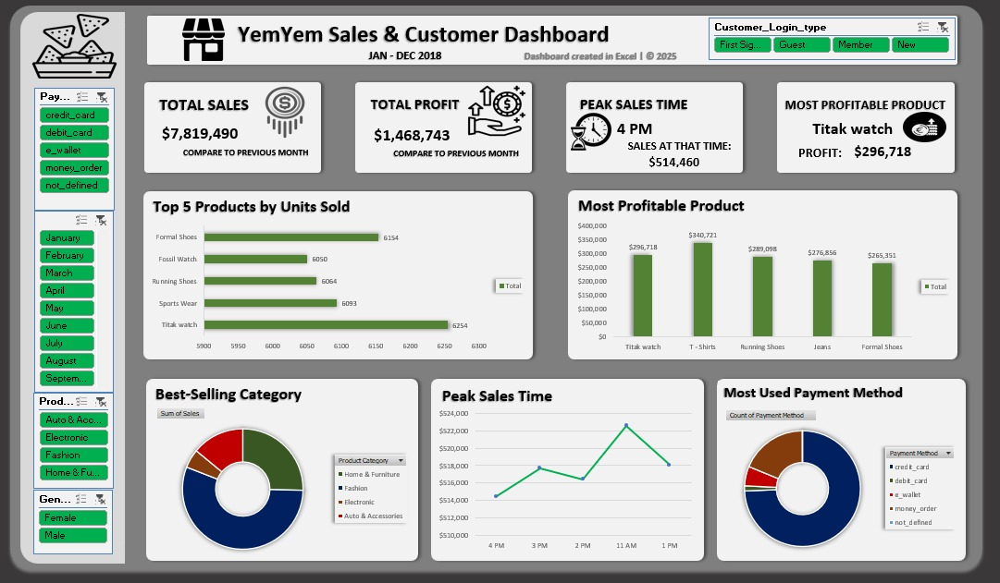

# E-Commerce Sales & Customer Analytics Dashboard

An interactive Excel dashboard project focused on analyzing e-commerce sales performance, customer behavior, profitability, and transaction trends to support data-driven business decisions.

## 📊 Dashboard Preview

## 🛠 Tools & Skills Used
- Microsoft Excel
- Pivot Tables
- Data Cleaning
- Data Visualization
- Business Analytics
- VLOOKUP Functions

## 🔧 Data Cleaning & Preparation

To prepare the dataset for analysis, the following steps were performed:

- Removed duplicate records
- Corrected inconsistencies and data errors
- Fixed gender formatting inconsistencies
- Filled missing values
- Used VLOOKUP to match:
  - Product Names
  - Product Categories
  - Payment Methods
- Added helper columns:
  - Day
  - Month
- Reformatted the dataset for better readability and analysis

## 📊 Business Questions Answered

Pivot table analysis was used to answer key business questions including:

- Top 5 Best-Selling Products
- Most Profitable Products
- Peak Sales Hours
- Best-Selling Product Categories
- Most Used Payment Method
- Customer Login Type Analysis
- Gender-Based Purchase Trends

## 📈 Key Business Insights

### 1. Fashion Products Generated the Highest Sales
Fashion products consistently recorded the strongest sales performance, showing high customer demand across the category.

### 2. Titak Watch Was the Best-Selling Product
Titak Watch recorded the highest number of units sold, making it the top-performing product by sales volume.

### 3. T-Shirts Generated the Highest Profit
Although some products sold more units, T-Shirts delivered the highest profitability due to stronger profit margins.

### 4. Peak Sales Occurred Between 11 AM – 4 PM
Customer purchasing activity was highest during midday shopping hours, indicating peak transaction periods.

### 5. Credit Card Was the Most Preferred Payment Method
Most customers completed transactions using credit cards, making it the dominant payment option.

### 6. Returning Customers Contributed Significantly to Sales
Member and returning customers generated a large portion of purchases, highlighting strong customer retention.

### 7. Female Customers Showed Higher Purchasing Activity
Female customers contributed more purchases across several product categories compared to male customers.

### 8. Home & Furniture and Fashion Categories Performed Strongly
Both categories consistently generated high revenue and profitability across transactions.

### 9. High Sales Volume Did Not Always Mean High Profit
Some products generated large sales volumes but lower profitability, showing the importance of analyzing both revenue and profit.

### 10. Customer Behavior Changed Across Filters
Interactive dashboard filtering revealed changing customer behavior across:
- Months
- Product Categories
- Payment Methods

## 📌 Conclusion

This dashboard helped uncover customer purchasing patterns, profitable product categories, and peak transaction periods that can support smarter business decisions, marketing strategies, and inventory planning.

## 📷 Dashboard Features

The interactive dashboard highlights:
- Total Sales
- Total Profit
- Peak Sales Hour
- Top Products
- Category Performance
- Customer Behavior Patterns
- Payment Trends
- Profitability Analysis
